<div align="center">
  
# 👋 Hi, I'm Virendra Naval

### 🚀 Computer Science Student | Full-Stack Developer

[](https://github.com/KanikaPunia119)
[](https://github.com/KanikaPunia119?tab=followers)
[](https://github.com/KanikaPunia119?tab=repositories)


</div>

---

## 💫 About Me

> *"Being a girl in tech isn't an advantage — it's proof that I've earned my place, line by line of code."*

```javascript
const Virendra = {
    role: "Computer Science Student",
    institute: "NIT Silchar",
    year: "Final Year",
    internships: ["Research Intern at NIT Silchar"],
    
    currentFocus: "Building scalable systems & solving algorithmic challenges",
    funFact: "Every bug is just an opportunity to learn something new! 🐛✨"
};
```

### 🎯 What I'm Up To

- 🔭 Currently exploring **Compititive Programming**
- 🌱 Learning advanced **algorithms** and **data structures**
- 💪 Practicing competitive programming on **Codeforces, LeetCode & CodeChef**
- 🎓 Preparing for full-time roles in **2026**
- 💡 Open to collaborating on **innovative projects**

---

## 🛠️ Tech Arsenal

<div align="">


</div>

---

## 📊 GitHub Analytics


<div align="center">

### 📈 Overall Statistics

<div align="center">
  
# 👋 Hi, I'm Virendra Naval

### 🚀 Computer Science Student | Full-Stack Developer

[](https://github.com/KanikaPunia119)
[](https://github.com/KanikaPunia119?tab=followers)
[](https://github.com/KanikaPunia119?tab=repositories)


</div>

---

## 💫 About Me

> *"Being a girl in tech isn't an advantage — it's proof that I've earned my place, line by line of code."*

```javascript
const Virendra = {
    role: "Computer Science Student",
    institute: "NIT Silchar",
    year: "Final Year",
    internships: ["Research Intern at NIT Silchar"],
    
    currentFocus: "Building scalable systems & solving algorithmic challenges",
    funFact: "Every bug is just an opportunity to learn something new! 🐛✨"
};
```

### 🎯 What I'm Up To

- 🔭 Currently exploring **Compititive Programming**
- 🌱 Learning advanced **algorithms** and **data structures**
- 💪 Practicing competitive programming on **Codeforces, LeetCode & CodeChef**
- 🎓 Preparing for full-time roles in **2026**
- 💡 Open to collaborating on **innovative projects**

---

## 🛠️ Tech Arsenal

<div align="">


</div>

---

## 📊 GitHub Analytics

<div align="center">

### 📈 Overall Statistics


### 📊 Contribution Graph


</div>

---

## 🎯 Lowlighter Metrics - Advanced GitHub Analytics

<div align="center">

### 📊 Comprehensive Overview


### 📅 3D Isometric Commit Calendar


### 🈷️ Most Used Languages (Detailed Analysis)


### 💡 Coding Habits & Activity Patterns


</div>


### 📰 Recent Activity Timeline


</div>

---

## 🏆 Competitive Programming Profiles

<div align="center">

[](https://codeforces.com/profile/kanika119)
[](https://leetcode.com/u/virendranaval21/)
[](https://www.codechef.com/users/virendranaval2)


### 📊 LeetCode Stats


</div>

---

---

## 💼 Experience & Achievements

<div align="center">

| 🏢 Organisation | 📅 Duration | 💼 Role |
|-----------|------------|---------|
| **NIT Silchar** | Summer 2024 | Research Intern |

### 🏆 Major Achievements

```
💻 Active Competitive Programmer 
📚 Consistent Problem Solver
```

</div>

---

## 📫 Let's Connect!

<div align="center">

[](https://linkedin.com/in/virendra-naval)
[](https://instagram.com/naval_virendra)
[](mailto:virendranaval21@gmail.com)


### 📧 Reach Out

**Email:** [virendranaval21@gmail.com](mailto:virendranaval21@gmail.com)

</div>

---

## 💭 Random Dev Quote

<div align="center">


</div>

---

## 🎵 Currently Vibing To

<div align="center">

[](https://spotify-github-profile.vercel.app/api/view?uid=YOUR_SPOTIFY_ID&redirect=true)

</div>

---

<div align="center">

### ⚡ Fun Fact

*Every opportunity I've earned came from hard work, consistency, and late-night debugging sessions.*

*Not luck. Not assumptions. Just pure dedication.* 💪

---

### 📊 This Week I Spent My Time On

<!--START_SECTION:waka-->
<!--END_SECTION:waka-->

---

### 🐍 Contribution Snake


---


**Made with 💖 and lots of ☕**

*Last Updated: Automatically via GitHub Actions*

</div>

### 📊 Contribution Graph


</div>

---

## 🎯 Lowlighter Metrics - Advanced GitHub Analytics

<div align="center">

### 📊 Comprehensive Overview


### 📅 3D Isometric Commit Calendar


### 🈷️ Most Used Languages (Detailed Analysis)


### 💡 Coding Habits & Activity Patterns


</div>


### 📰 Recent Activity Timeline


</div>

---

## 🏆 Competitive Programming Profiles

<div align="center">

[](https://codeforces.com/profile/kanika119)
[](https://leetcode.com/u/virendranaval21/)
[](https://www.codechef.com/users/virendranaval2)


### 📊 LeetCode Stats


</div>

---

---

## 💼 Experience & Achievements

<div align="center">

| 🏢 Company | 📅 Duration | 💼 Role |
|-----------|------------|---------|
| **NIT Silchar** | Summer 2024 | Research Intern |

### 🏆 Major Achievements

```
💻 Active Competitive Programmer 
📚 Consistent Problem Solver
```

</div>

---

## 📫 Let's Connect!

<div align="center">

[](https://linkedin.com/in/virendra-naval)
[](https://instagram.com/naval_virendra)
[](mailto:virendranaval21@gmail.com)


### 📧 Reach Out

**Email:** [virendranaval21@gmail.com](mailto:virendranaval21@gmail.com)

</div>

---

## 💭 Random Dev Quote

<div align="center">


</div>

---

## 🎵 Currently Vibing To

<div align="center">

[](https://spotify-github-profile.vercel.app/api/view?uid=YOUR_SPOTIFY_ID&redirect=true)

</div>

---

<div align="center">

### ⚡ Fun Fact

*Every opportunity I've earned came from hard work, consistency, and late-night debugging sessions.*

*Not luck. Not assumptions. Just pure dedication.* 💪

---

### 📊 This Week I Spent My Time On

<!--START_SECTION:waka-->
<!--END_SECTION:waka-->

---

### 🐍 Contribution Snake


---


**Made with 💖 and lots of ☕**

*Last Updated: Automatically via GitHub Actions*

</div>
